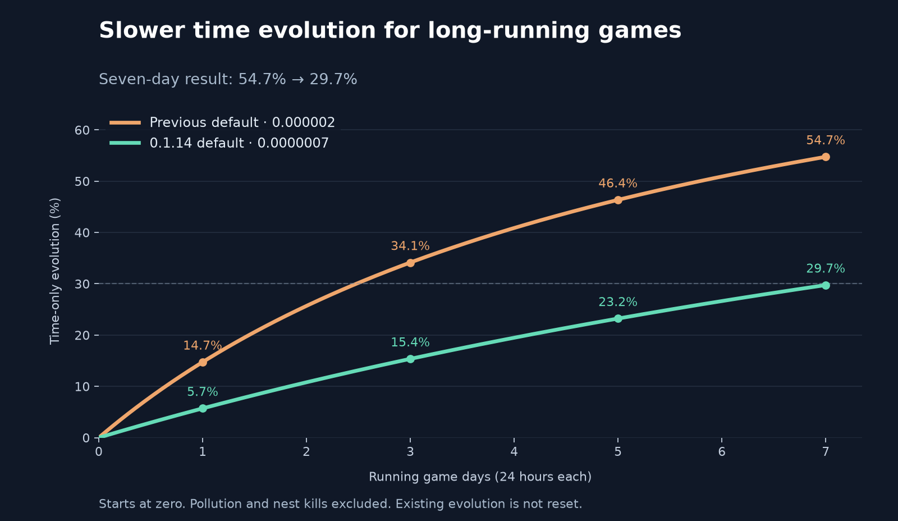

# Time evolution defaults

Version 0.1.14 changes the default time evolution factor from `0.000002` to
`0.0000007`. Pollution stays at `0.0000006`, and nest destruction stays at `0.003`.

The chart starts at zero evolution and excludes pollution and nest kills. One day
means 24 hours of running simulation; paused server time does not count.

| Running days | Previous default | 0.1.14 default |
| --- | ---: | ---: |
| 1 | 14.7% | 5.7% |
| 2 | 25.7% | 10.8% |
| 3 | 34.1% | 15.4% |
| 4 | 40.9% | 19.5% |
| 5 | 46.4% | 23.2% |
| 6 | 50.9% | 26.6% |
| 7 | 54.7% | 29.7% |

The rate is approximately 65% lower, so a given time-only evolution level takes
about 2.86 times as long to reach. This does not mean total evolution will be 65%
lower: pollution and nest kills still contribute, and evolution slows as it rises.

For time-only evolution from zero, the approximate curve is
`evolution = (rate * seconds) / (1 + rate * seconds)`. Solving for 0.30 at seven
days gives `rate = 0.30 / (1 - 0.30) / (7 * 86400)`. We round this to
`0.0000007` for a simpler setting, giving approximately 29.7% after seven days.
This models Factorio's diminishing growth; it is not a fixed daily percentage
increase. See the [Factorio evolution mechanics](https://wiki.factorio.com/Enemies#Evolution).

Existing saves keep their stored settings and accumulated evolution. An admin
can apply this rate through **Settings > Mod settings > Map > Time evolution factor**.
